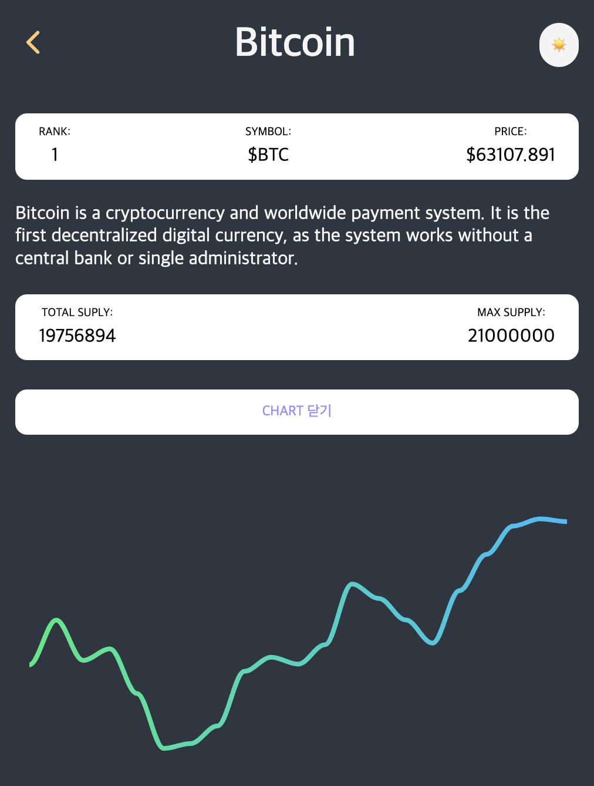

# 🪙 BitCoin (Crypto Tracker)

> React Practice Project

<br />

### npm install🧚‍♂️

```bash
npm install
npm start
```

👉 http://localhost:3000/ 접속됩니니다.

<br />

### Using🥷

- Styled Components
- TypeScript(4v)
- React Router Dom (6v)
  - useParams
  - useLocation
  - useParams
  - Outlet
  - Link
  - useMatch
- React Query
- Recoil
- Apex Charts

<br />



